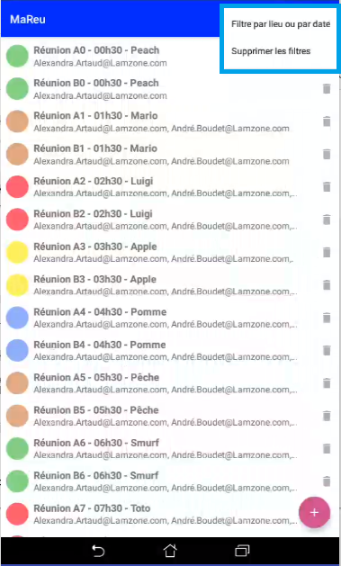

# OpenClassrooms
Ce dépôt contient une application pour le P4 du parcours **PRFE3**.
# MaRéu

## Table des matières
1. [Informations générales]
2. [Technologies]
6. [Tests]
7. [Screenshots]
8. [Crédits]

## Informations générales
Nom du projet : **MaRéu**
***
Application de gestion de réunions   

### Fonctionnalités :
* Affichage de liste de réunions comprenant :
	* l’heure de la réunion ;
	* le lieu de la réunion ;
	* le sujet de la réunion ;
	* la liste des participants (adresses mail).   
* Ajout d’une réunion
* Suppression d’une réunion
* Filtre des réunions par date ou par lieu
* Gestion de l’affichage responsive sur toutes les tailles de téléphone et de tablette Android, en modes portrait et paysage.

Options supplémentaires :
* Tri par date croissante/décroissante
* Tri par lieu croissant/décroissant

## Technologies
Liste des technologies utilisées dans ce projet
* [Android Studio](https://developer.android.com/studio/) : Version 4.1.3
* [viewBinding](https://developer.android.com/topic/libraries/view-binding) : since Android Studio 3.6
* [Gradle](https://developer.android.com/studio/releases/gradle-plugin) : Version 4.1.3
* [EventBus](https://greenrobot.org/eventbus/) : Version 3.2.0
* [JUnit](https://github.com/junit-team/junit4/wiki) : Version 4.13
* [Espresso](https://developer.android.com/training/testing/espresso) : Version 3.3.0

### Démarrage
Version de SdK min : 21
Pour une application supportant Android 5.0 (API21) et ses versions supérieures

### Statut :
En cours de développement

#### Modifications prévues : roadmap
Empêcher création de doublon avec message d'avertissement
Vérifier les places disponibles dans la salle de la réunion en cours de création
Gestion des exceptions en cas de validation de formulaire avec données manquantes

### Auteur :
Stéphane

## Screenshots
* L'utilisateur filtre les réunions pour la consultation de liste, avec des options de tri. 

 

 	
 	
    
    
 

* L'utilisateur ajoute une réunion  

 

 	
 	
 

 
* L'utilisateur supprime une réunion 

 

 	
 
 

## Tests
* Tests unitaires locaux
    * com\companyx\mareu\data\DummyApiServiceReunionsTest.java
        * filtrerLieu()
        * filtrerPlusieursLieux()
        * filtrerDate()
        * filtrerDateEtLieu()
        * ajouterReunion()
        * supprimerReunion()            
            Options supplémentaires :
            * trierLieuCroissant()
            * trierLieuDecroissant()
            * trierDateDecroissant()
            * trierDateCroissant()

* Tests unitaires instrumentés
    * com\companyx\mareu\controller\activities\MainActivityTest.java
        * onMainActivityReunionListShouldBeDisplayed()
        * onDeleteClickReunionListShouldBeDisplayedMinusITem()
        * onNoFilterActionRawListShouldBeDisplayed()
            Options supplémentaires :
            * onRoomDownSortingActionSortedListShouldBeDisplayed()
            * onDateUpSortingActionSortedListShouldBeDisplayed()
            * onDateDownSortingActionSortedListShouldBeDisplayed()
            * onNoSortingActionSortedListShouldBeDisplayed()

    * com\companyx\mareu\controller\activities\MainActivityTest_ForcingExecution.java
        Options supplémentaires :
        * onRoomUpSortingActionSortedListShouldBeDisplayed()

    * com\companyx\mareu\controller\activities\AddMeetingActivityTest.java
	    * onValidatingNewMeetingReunionListShouldDisplayExtraItem()

    * com\companyx\mareu\controller\activities\AddMeetingActivityTest_ForcingExecution.java
	    * onCancellingNewMeetingReunionListShouldDisplayNoExtraItem()

    * com\companyx\mareu\controller\activities\FilteringActivityTest.java
        * onOneRoomFilteredActionFilteredListShouldBeDisplayed()
        * onManyRoomFilteredActionFilteredListShouldBeDisplayed()
        * onRoomAndDateFilteredActionFilteredListShouldBeDisplayed()
        * onFilterCancellationOriginalListShouldBeDisplayed()
        * onDateFilteredActionFilteredListShouldBeDisplayed()

## Crédits
Les guides et questions/réponses disponibles aux URL suivants:
* https://devstory.net/10559/android-autocompletetextview-multiautocompletetextview
* https://www.jmdoudoux.fr/java/dej/chap-utilisation_dates.htm#utilisation_dates-2
* https://stackoverflow.com/questions/43149728/select-date-from-calendar-in-android-espresso

